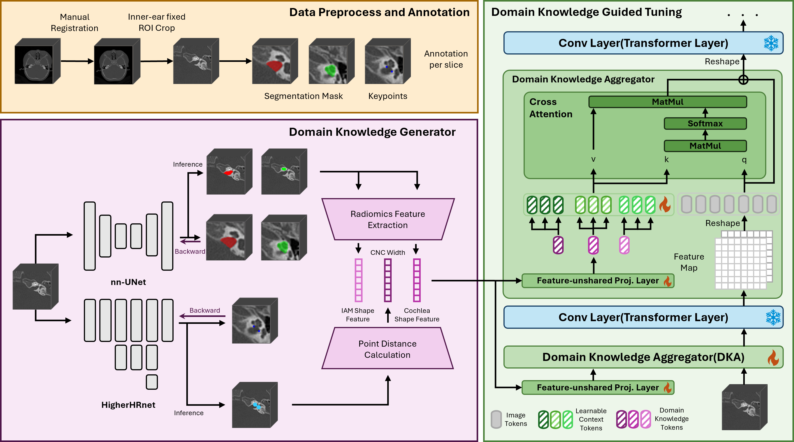

# Tuning Medical Foundation Models for Inner Ear Temporal CT Analysis with Plug-and-play Domain Knowledge Aggregator

Plug-and-Play Domain Knowledge Aggregator for inner ear CT analysis.

## 📜 Introduction

The CIED dataset is constructed by Visual and Intelligent Learning Lab, Tongji University and Department of Otolaryngology-Head and Neck Surgery, Shanghai Ninth People's Hospital, Shanghai Jiao Tong University School of Medicine.



Fig 1. The overall architecture of our pipeline. DKGT consists of two main components: Domain Knowledge Generator and Domain Knowledge Aggregator.

## Training

Clone the code and follow the institution to install Merlin and CT-FM and download their pretrained models.

To train/evaluate DKGT on CT-FM on IEITD, do

```sh
cd CT-FM/
python ci_pmt_train.py --lr learning_rate --wd weight_decay --fold $fold
```

To train/evaluate DKGT on Merlin on IEITD, do

```sh
cd Merlin/documentation/
python ci_pmt_train.py --lr learning_rate --wd weight_decay --fold $fold
```

To visualize DKA on Merlin on IEITD, do

```sh
cd Merlin/documentation/
python visualize.py --fold $fold
```

## TODO

Upload SAM-Med3D and model weights.

## Dataset

The CIED is now available on [Google Drive](https://drive.google.com/drive/folders/197Sjr4oUUJEFro6r2i-l5LJPkCiyMipb?usp=sharing).

## Reference

This code is based on [Merlin](https://github.com/StanfordMIMI/Merlin) and [CT-FM](https://github.com/project-lighter/CT-FM).
